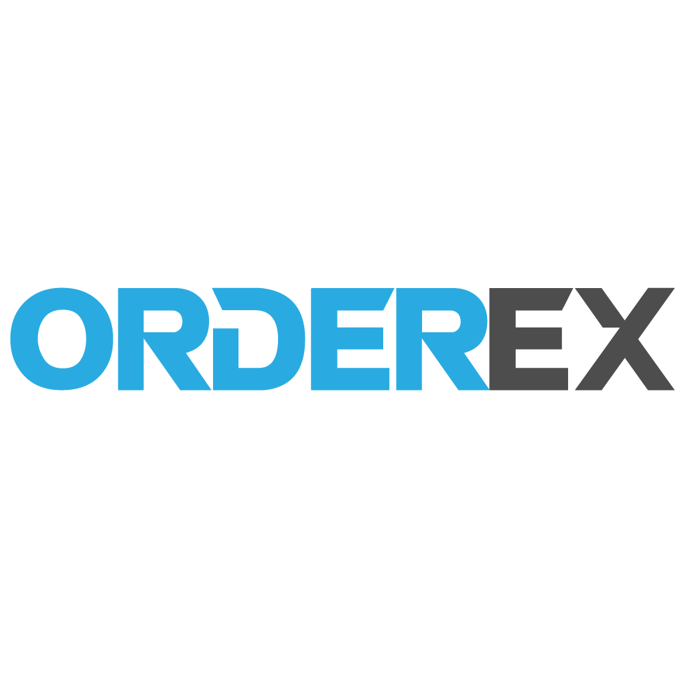

Orderex is an application built with react/js, using electron as a framework and python for the heavy lifting.  Orderex allows users to place orders on many exchanges using multiple accounts, proxy, special conditions and more!

## Getting Started

Getting started guide will go here :)